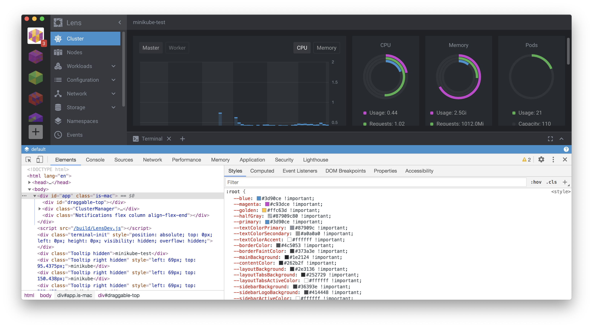

# Styling an extension
Lens provides a set of global styles and UI components that can be used by any extension to preserve look and feel of the application.

## Styling approach
Lens heavily uses SCSS preprocessor with a set of predefined variables and mixins.

For layout tasks Lens is using [flex.box](https://www.npmjs.com/package/flex.box) library which provides helpful class names to specify some of the [flexbox](https://developer.mozilla.org/en-US/docs/Web/CSS/CSS_Flexible_Box_Layout/Basic_Concepts_of_Flexbox) properties. For example, `div` with class names:
```
<div className="flex column align-center"></div>
```
at the end will have following css properties:
```
div {
  display: flex;
  flex-direction: column;
  align-items: center;
}
```

However, feel free to use any styling technique or framework like [Emotion](https://github.com/emotion-js/emotion) or just plain CSS if you prefer.

## Themes
Lens using 2 built-in themes located in `src/renderer/themes` folder each for light and dark color schemes. Active theme can be changed in the `Preferences` page.


When Lens gets loaded it transforms selected theme `json` file into list of [CSS Custom Properties (CSS Variables)](https://developer.mozilla.org/en-US/docs/Web/CSS/Using_CSS_custom_properties) which then gets injected into `:root` element so any of the down-level components can use them.


When user changes a theme, the process is repeated, new css variables appear instead of previous ones.

If you want to follow a selected theme to keep the 'native' Lens look and feel, respecting the light/dark appearance of your extension, you can use provided variables and build-in lens components such as buttons, dropdowns, checkboxes etc.

## Injected styles
Every extention is affected by list of default global styles defined in `src/renderer/components/app.scss`. These are basic browser resets like setting `box-sizing` property for every element, default text and background colors, default font size, basic headings visualisation etc.

Extension may overwrite them if needed.

## Variables to use
### Basic styling
There is a list of CSS Variables available for extension to use. Basic variables located inside `:root` selected in `src/renderer/components/app.scss`:
```
  --unit: 8px;
  --padding: var(--unit);
  --margin: var(--unit);
  --border-radius: 3px;
  --font-main: 'Roboto', 'Helvetica', 'Arial', sans-serif;
  --font-monospace: Lucida Console, Monaco, Consolas, monospace;
  --font-size-small: calc(1.5 * var(--unit));
  --font-size: calc(1.75 * var(--unit));
  --font-size-big: calc(2 * var(--unit));
  --font-weight-thin: 300;
  --font-weight-normal: 400;
  --font-weight-bold: 500;
```

They're intended to set consistent paddings and font-sizes across components, e.g.
```
.status {
  padding-left: calc(var(--padding) * 2);
  font-size: var(--font-size-small);
}
```

### Themable colors
After theme file gets parsed it provides list of theme-defined colors. Most of their values are different for light and dark themes. You can use them to preserve consitent view of extension with respect of selected theme.
```
  "blue": "#3d90ce",
  "magenta": "#c93dce",
  "golden": "#ffc63d",
  "halfGray": "#87909c80",
  "primary": "#3d90ce",
  "textColorPrimary": "#555555",
  "textColorSecondary": "#51575d",
  "textColorAccent": "#333333",
  "borderColor": "#c9cfd3",
  "borderFaintColor": "#dfdfdf",
  "mainBackground": "#f1f1f1",
  "contentColor": "#ffffff",
  "layoutBackground": "#e8e8e8",
  "layoutTabsBackground": "#f8f8f8",
  "layoutTabsActiveColor": "#333333",
  "layoutTabsLineColor": "#87909c80"
  ...
...
```

They can be used in form of `var(--magenta)`.

A complete list of all themable colors can be found in the [color reference](../color-reference).

Colors values are located inside `src/renderer/themes/lens-dark.json` and `src/renderer/themes/lens-light.json` files.

## Using CSS Variables inside CSS-in-JS components
If a developer uses an `Emotion` (or similar) framework to work with styles inside an extension, they can use variables in the following form:
```
const Container = styled.div(() => ({
  backgroundColor: 'var(--mainBackground)'
}));
```